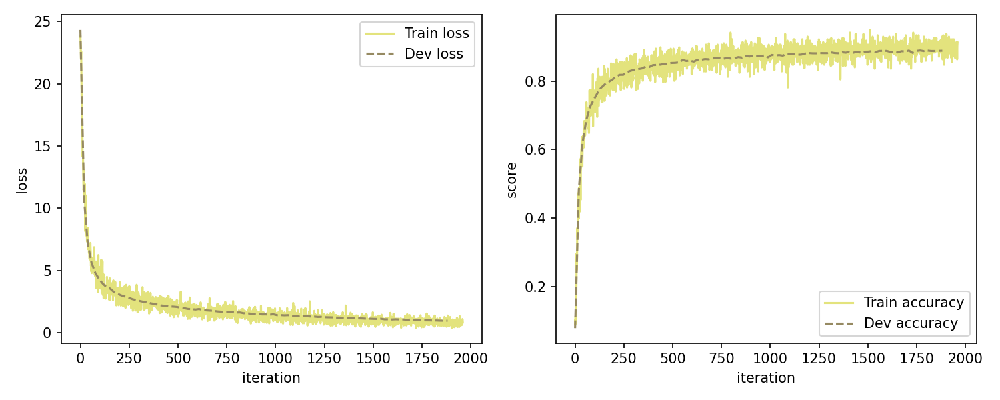
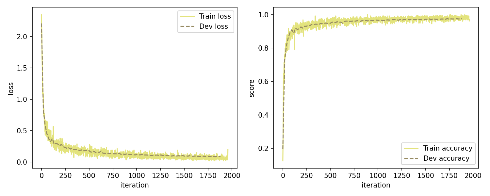
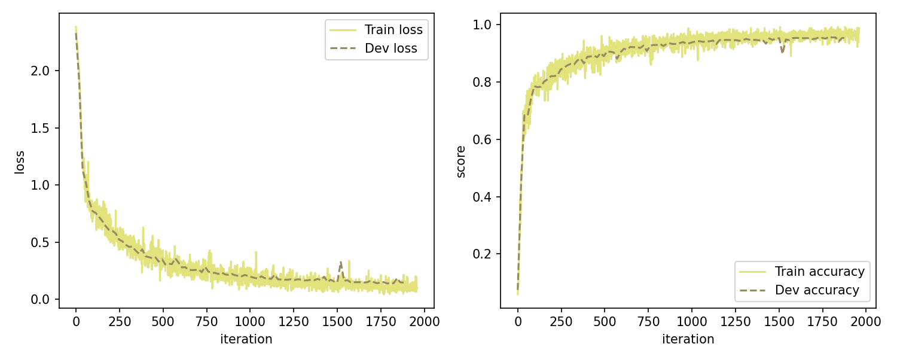
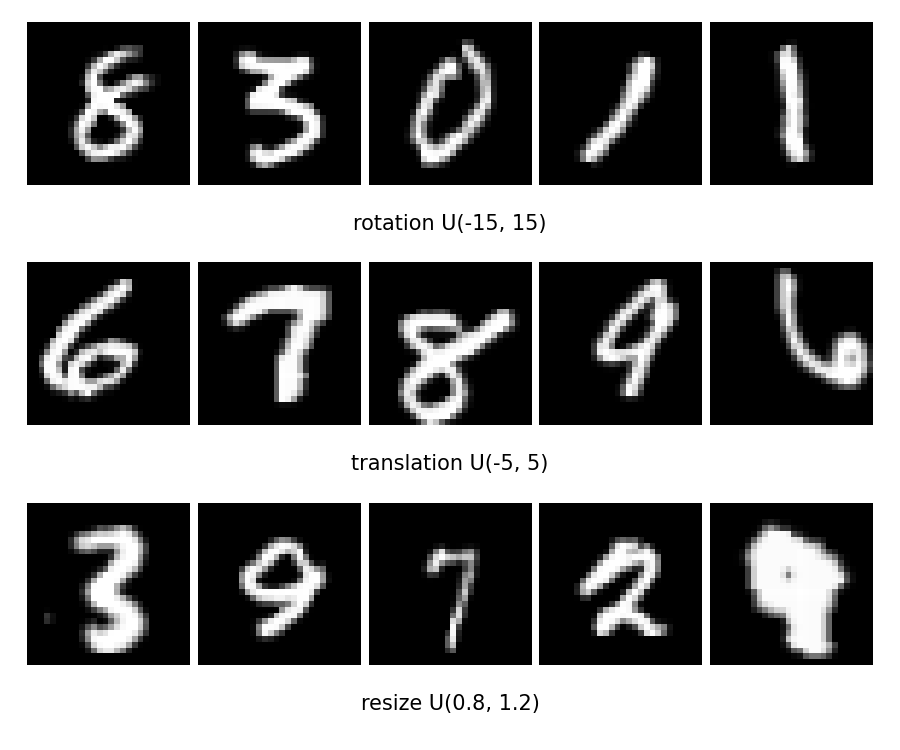
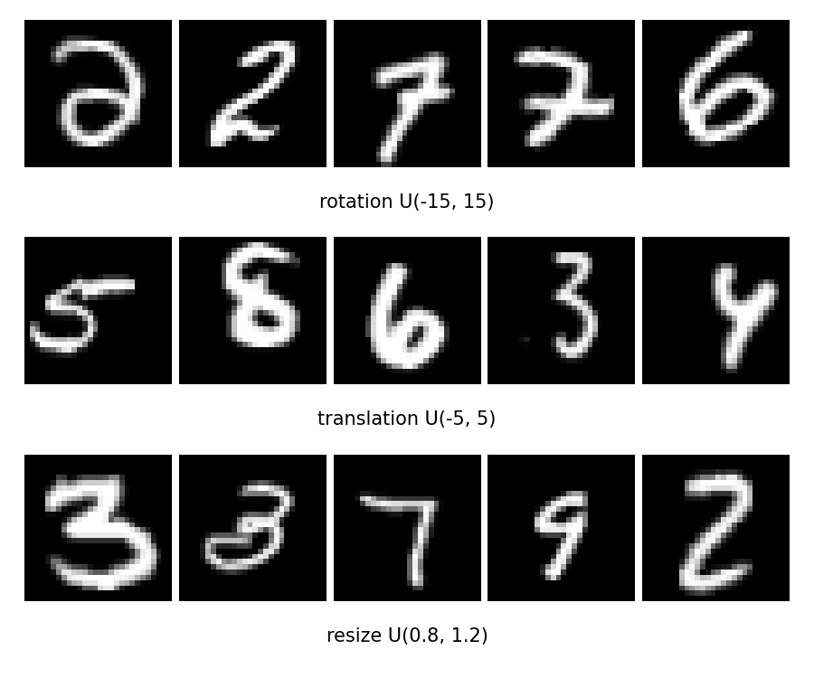
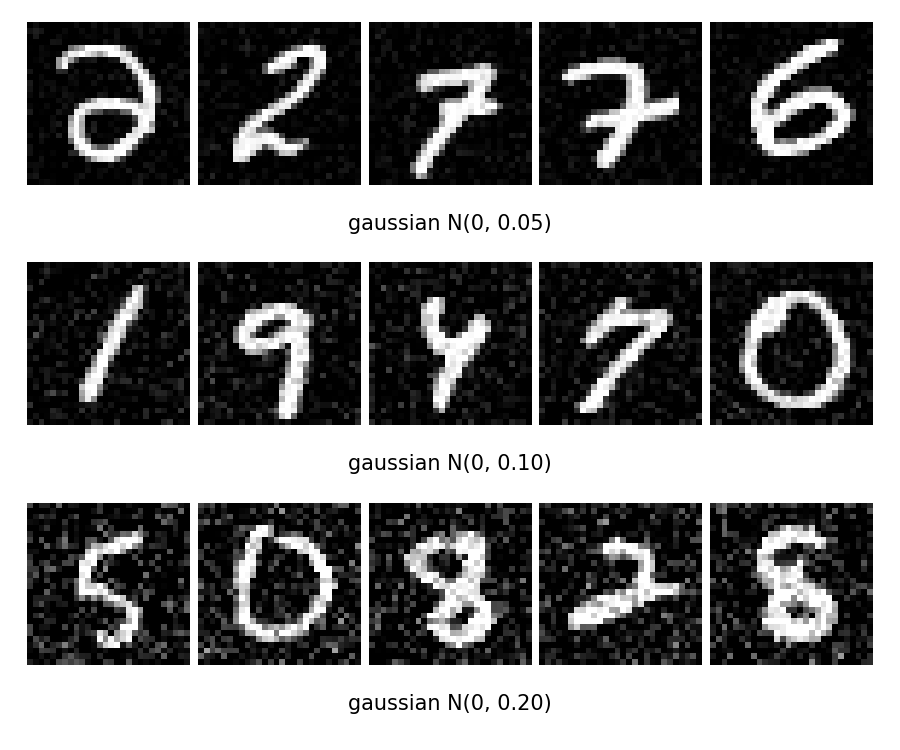

# Project 1: 基于 NumPy 的 MNIST 分类

本项目在 `PJ1/` 目录下使用 `NumPy` 从零实现 MNIST 手写数字分类流程，不依赖 PyTorch、TensorFlow 等深度学习框架。项目完成了三组实验：

- `MLP` baseline：实现 `Linear`、`ReLU` 与带 softmax 的交叉熵损失。
- `CNN`：实现 `conv2D`，使用两层卷积网络完成分类，并与 MLP 比较。
- `CNN + DataAug`：在训练阶段加入随机几何增强，并在旋转、平移、缩放和高斯噪声测试集上分析鲁棒性。

当前实现中的 MLP 结构为 `784 -> 128 -> 10`；CNN 结构为两层步长卷积加两层全连接分类头。三组训练均使用 `SGD`、学习率 `0.06`、batch size `256`、训练 `10` 个 epoch，随机种子固定为 `309`。

### 1. 环境依赖

建议使用 Python `3.9+`。主流程依赖如下：

```bash
pip install numpy matplotlib tqdm
```

如需查看 `dataset_explore.ipynb`，另行安装 Jupyter 环境即可。

### 2. 数据准备

代码直接读取 gzip 压缩的 MNIST IDX 文件。请将原始数据放置为：

```text
dataset/MNIST/
|-- train-images-idx3-ubyte.gz
|-- train-labels-idx1-ubyte.gz
|-- t10k-images-idx3-ubyte.gz
`-- t10k-labels-idx1-ubyte.gz
```

训练脚本会将原始训练集随机划分为 `50000` 个训练样本与 `10000` 个验证样本，原始测试集包含 `10000` 个样本。图像均归一化到 `[0, 1]`；MLP 接收展平后的 `784` 维输入，CNN 接收 `[N, 1, 28, 28]` 输入。

在训练增强模型前，先生成增强训练集：

```bash
python data_augment.py
```

该脚本对每张训练图像以 `0.5` 概率随机应用一次旋转、平移或缩放，并生成：

```text
dataset/MNIST_augment/train_images.npy
dataset/MNIST_augment/train_labels.npy
outputs/figures/dataaug.png
```

在进行鲁棒性测试前，生成扰动测试集：

```bash
python robust_analysis.py
```

扰动包括旋转 `[-15, 15]` 度、平移 `[-5, 5]` 像素、缩放 `[0.8, 1.2]`、随机几何变换，以及标准差为 `0.05`、`0.10`、`0.20` 的高斯噪声。生成的数据保存在 `dataset/MNIST_robust/`，示例图保存在 `outputs/figures/`。

### 3. 项目结构

```text
PJ1/
|-- mynn/
|   |-- op.py                 # Linear、conv2D、ReLU、MultiCrossEntropyLoss
|   |-- models.py             # Model_MLP 与 Model_CNN
|   |-- optimizer.py          # SGD 等优化器
|   |-- runner.py             # 训练、验证与最佳模型保存流程
|   `-- metric.py             # accuracy 指标
|-- draw_tools/
|   |-- plot.py               # 训练/验证学习曲线
|   `-- robustness.py         # 鲁棒性准确率柱状图
|-- data_augment.py           # 增强训练数据生成
|-- robust_analysis.py        # 扰动测试数据生成
|-- test_train.py             # MLP、CNN、CNN + DataAug 三组训练入口
|-- test_model.py             # clean/扰动测试入口，追加写入 CSV
|-- dataset/                  # MNIST 与生成的数据文件
`-- outputs/                  # 指标、模型、CSV 与可视化图片
```

`mynn/op.py` 中的线性层、卷积层和交叉熵反向传播均为 NumPy 实现；`Model_CNN` 的卷积结构为：

```text
Conv2D(1, 16, 3, stride=2, padding=1) -> ReLU
Conv2D(16, 32, 3, stride=2, padding=1) -> ReLU
Linear(32 * 7 * 7, 64) -> ReLU -> Linear(64, 10)
```

### 4. 训练与测试

训练三组模型

```bash
python data_augment.py
python test_train.py
```

`test_train.py` 会依次训练 `MLP`、`CNN` 和 `CNN + DataAug`，分别保存指标、学习曲线与模型参数，用于后续 clean 测试和鲁棒性评估。

原始测试集评估

```bash
python test_model.py --model mlp --data clean
python test_model.py --model cnn --data clean
python test_model.py --model cnn_dataaug --data clean
```

可选模型名为 `mlp`、`cnn` 和 `cnn_dataaug`，每次运行都会将结果追加写入 `outputs/test_model.csv`。

鲁棒性评估中，首先生成扰动测试集，然后对三个模型和八类测试数据进行评估并绘制准确率对比图：

```powershell
python robust_analysis.py

$models = "mlp", "cnn", "cnn_dataaug"
$datasets = "clean", "rotate", "translate", "resize", "transform", "gaussian_0.05", "gaussian_0.10", "gaussian_0.20"

foreach ($model in $models) {
    foreach ($data in $datasets) {
        python test_model.py --model $model --data $data
    }
}

python draw_tools/robustness.py
```

评估汇总结果位于 `outputs/test_model.csv`，可视化结果位于 `outputs/figures/robust_bar.png`。

### 5. 实验结果

原始数据集

| 模型 | 最佳验证集准确率 | Clean 测试准确率 |
| --- | ---: | ---: |
| MLP | 0.8885 | 0.8938 |
| CNN | 0.9760 | 0.9771 |
| CNN + DataAug | 0.9571 | 0.9806 |

| MLP learning curve | CNN learning curve | CNN + DataAug learning curve |
| --- | --- | --- |
|  |  |  |

增强数据集

| 数据增强示例 | 几何扰动示例 | 高斯噪声示例 |
| --- | --- | --- |
|  |  |  |

| 模型 | Clean | Rotate | Translate | Resize | Transform | Gaussian 0.05 | Gaussian 0.10 | Gaussian 0.20 |
| --- | ---: | ---: | ---: | ---: | ---: | ---: | ---: | ---: |
| MLP | 0.8938 | 0.8789 | 0.2688 | 0.8441 | 0.6629 | 0.8857 | 0.8522 | 0.7073 |
| CNN | 0.9771 | 0.9652 | 0.4469 | 0.9543 | 0.7835 | 0.9754 | 0.9732 | 0.9463 |
| CNN + DataAug | 0.9806 | 0.9723 | 0.8859 | 0.9755 | 0.9418 | 0.9779 | 0.9675 | 0.8166 |